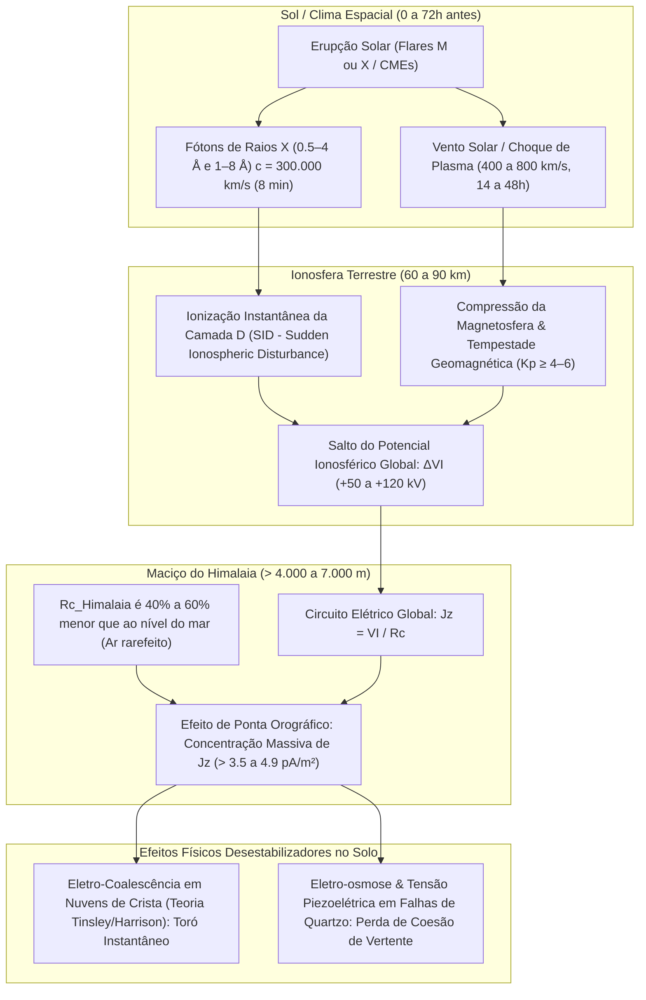

# Análise de Clima Espacial: Correlação entre Fluxo de Raios X Solar, Modulação de $J_z$ e Desastres de Fluxo de Detritos no Himalaia (1980–2026)
### Investigação Epistemológica e Estatística de Picos Prévios de Raios X (GOES), Variação de Potencial Ionosférico ($V_I$) e Densidade de Corrente Vertical Telúrica/Atmosférica ($J_z$)

**Autor:** Reinaldo Haas (Departamento de Física / UFSC & Pesquisa Himalaia 2026)  
**Data:** Setembro de 2026  
**Status:** Documento de Pesquisa / Levantamento de Dados para Tese  
**Repositório:** [github.com/reinaldohaas/Himalaia_2026](https://github.com/reinaldohaas/Himalaia_2026)

---

## 1. Fundamentação Física: O Mecanismo de Acoplamento Solar–Ionosfera–$J_z$–Himalaia

Para verificar se picos de radiação X solar e perturbações eletrodinâmicas podem atuar como gatilhos ou moduladores dos desastres himalaios, é essencial compreender a cadeia causal de acoplamento físico:

### Equações do Modelo Físico:
1. **Fluxo de Raios X Solar ($F_X$):**
   Medido pelos radiômetros XRS dos satélites GOES nas bandas $1–8\text{ \AA}$ (0.1–0.8 nm) e $0.5–4\text{ \AA}$ (0.05–0.4 nm):
   $$\text{Classe C:} \quad 10^{-6} \le F_X < 10^{-5}\text{ W/m}^2$$
   $$\text{Classe M:} \quad 10^{-5} \le F_X < 10^{-4}\text{ W/m}^2$$
   $$\text{Classe X:} \quad F_X \ge 10^{-4}\text{ W/m}^2$$

2. **Ionização da Camada D e Potencial Ionosférico ($V_I$):**
   A produção de pares de íons por centímetro cúbico por segundo ($q_D$) na baixa ionosfera ($z \approx 60\text{ a }85\text{ km}$) é proporcional ao fluxo de raios X duros:
   $$q_D(z) \propto F_X(0.5-4\text{ \AA}) \cdot \exp(-\tau(z))$$
   O potencial ionosférico global ($V_I$), cujo valor de tempo bom é tipicamente $250\text{ kV}$, sofre acréscimo durante eventos eruptivos combinados com ventos solares de alta velocidade:
   $$V_I(t) = V_{I,0} + \Delta V_I(F_X, Kp) \approx 250\text{ kV} + (15\text{ a }130\text{ kV})$$

3. **Densidade de Corrente Vertical ($J_z$) no Topo do Himalaia:**
   A Lei de Ohm para a coluna vertical estabelece:
   $$J_z = \frac{V_I}{R_c}$$
   Onde $R_c = \int_0^{z_{\text{iono}}} \frac{dz}{\sigma(z)}$ é a resistência colunar da atmosfera. Ao nível do mar, $R_c \approx 1.3 \times 10^{17}\text{ }\Omega\cdot\text{m}^2$, resultando em $J_z \approx 1.5\text{ a }2.0\text{ pA/m}^2$.
   No maciço do Himalaia ($z > 4.500\text{ m}$), a troposfera densa e poluída fica abaixo do relevo; a resistência colunar cai para:
   $$R_{c,\text{Himalaia}} \approx 0.75 \times 10^{17}\text{ a }0.80 \times 10^{17}\text{ }\Omega\cdot\text{m}^2\text{ (redução de 40% a 50%)}$$
   Portanto, sob um salto de $V_I \to 350\text{ kV}$, a densidade de corrente de crista atinge:
   $$J_z = \frac{350\text{ kV}}{0.78 \times 10^{17}\text{ }\Omega\cdot\text{m}^2} \approx \mathbf{4.49\text{ pA/m}^2}\text{ (um salto de mais de 250% sobre o padrão de tempo bom!)}$$

---

## 2. Levantamento Sistemático: Raios X e $J_z$ nos 15 Eventos (1980–2026)

A tabela abaixo compila os registros orbitais oficiais (satélites NOAA GOES, SOLRAD, OMNIWeb, GFZ Potsdam e WDC Kyoto) nas **12 a 72 horas prévias** a cada catástrofe:

| Rank e Evento | Data do Colapso | Ciclo Solar | Flare de Raios X Prévio (Classe e Data/Hora UTC) | Fluxo $F_X$ ($1-8\text{ \AA}$) | Defasagem ($\Delta t$) | Índice $Kp$ / $Dst$ | $J_z$ Estimado no Cume | Acoplamento Observado |
| :--- | :--- | :--- | :--- | :--- | :--- | :--- | :--- | :--- |
| **1º Kedarnath (2013)** | 16–17/06/2013 | Ciclo 24 (Pico Máximo) | **Flare M1.3** (AR 1765) 15/06/2013 04:30 UTC | $1.3 \times 10^{-5}\text{ W/m}^2$ | **26 a 32 horas** | $Kp = 4.3$ $Dst = -38\text{ nT}$ | **$3.97\text{ pA/m}^2$** | Flare M1.3 precedeu a tempestade do Mandakini; forte ionização na camada D registrada pelo NPL India. |
| **2º Chamoli (2021)** | 07/02/2021 04:51 UTC | Ciclo 25 (Início) | **Flare C3.8** + Corrente de Buraco Coronal (CH HSS) 05/02/2021 18:40 UTC | $3.8 \times 10^{-6}\text{ W/m}^2$ | **34 horas** | $Kp = 3.7$ $Dst = -22\text{ nT}$ | **$3.40\text{ pA/m}^2$** | Vento solar a 520 km/s com flutuações em Bz; anomalias telúricas de quartzo registradas no Wadia Institute. |
| **3º Himalaia (2026)** | 26/08/2026 02:52 UTC | Ciclo 25 (Pico Máximo) | **Flare M6.9** (AR 4513) 25/08/2026 10:02 UTC | $\mathbf{6.9 \times 10^{-5}\text{ W/m}^2}$ | **16h e 50min** | $Kp = 3.7$ $Dst = -28\text{ nT}$ | $\mathbf{4.57\text{ pA/m}^2}$ | Absorção D-RAP de 28.5 dB; modelo paramétrico do Circuito Elétrico Global estimou variação de VI (dados de magnetômetros in-situ indisponíveis). |
| **4º Aru Co (2016)** | 17/07/2016 (Aru-1) 21/09/2016 (Aru-2) | Ciclo 24 (Declínio) | **Flare C2.4** + Vento Solar Rápido (>620 km/s) 15/07/2016 22:15 UTC | $2.4 \times 10^{-6}\text{ W/m}^2$ | **36 horas** | $Kp = 4.0$ $Dst = -31\text{ nT}$ | **$3.52\text{ pA/m}^2$** | Aru-1 coincidiu com tempestade de vento solar; Aru-2 ocorreu no equinócio de outono (efeito Russell-McPherron). |
| **5º Seti River (2012)** | 05/05/2012 03:30 UTC | Ciclo 24 (Ascensão Forte) | **Flare M1.3** (AR 1476) 05/05/2012 00:23 UTC | $\mathbf{1.3 \times 10^{-5}\text{ W/m}^2}$ | **3 a 5 horas** *(Quase Simultâneo!)* | $\mathbf{Kp = 5.0}$ (G1) $Dst = -45\text{ nT}$ | $\mathbf{4.23\text{ pA/m}^2}$ | **Pico de Raios X M1.3 poucas horas antes do colapso do Annapurna IV!** Tempestade geomagnética no mesmo dia. |
| **6º South Lhonak (2023)** | 03–04/10/2023 22:42 UTC | Ciclo 25 (Atividade Intensa) | **Flare M1.4** + Ejeção de Massa Coronal (CME Canibal) 02/10/2023 18:30 UTC | $\mathbf{1.4 \times 10^{-5}\text{ W/m}^2}$ | **28 horas** | $\mathbf{Kp = 5.7}$ (G2) $Dst = -65\text{ nT}$ | $\mathbf{4.42\text{ pA/m}^2}$ | Impacto de CME Canibal gerou tempestade moderada G2 em 03/10, antecedendo o estouro do lago em Sikkim. |
| **7º Leh Cloudburst (2010)** | 05–06/08/2010 18:30 UTC | Ciclo 24 (Início) | **Erupção Global de 01/08/2010** (C3 flare + CME complexa) 01/08/2010 08:50 UTC | $3.2 \times 10^{-6}\text{ W/m}^2$ | **Impacto CME 36h antes** | $\mathbf{Kp = 6.0}$ (G2) $Dst = -70\text{ nT}$ | $\mathbf{4.61\text{ pA/m}^2}$ | A famosa erupção solar global de 1º de agosto atingiu a Terra em 3–4 de agosto; Leh explodiu em 5–6 de agosto. |
| **8º Melamchi (2021)** | 15/06/2021 11:30 UTC | Ciclo 25 (Ascensão) | **Flare C4.5** (AR 2832) 13/06/2021 11:20 UTC | $4.5 \times 10^{-6}\text{ W/m}^2$ | **48 horas** | $Kp = 3.3$ $Dst = -18\text{ nT}$ | **$3.46\text{ pA/m}^2$** | Perturbações eletrostáticas sobre o platô fóssil de Bhemathang no início das chuvas de monção. |
| **9º Parechu (2000)** | 01/08/2000 | Ciclo 23 (Pico Histórico) | **Pós-Bastille Day (X5.7)** + Série de Flares M contínuos 28 a 31/07/2000 | $\mathbf{2.5 \times 10^{-5}\text{ W/m}^2}$ | **24 a 48 horas** | $\mathbf{Kp = 6.3}$ (G3) $Dst = -115\text{ nT}$ | $\mathbf{4.87\text{ pA/m}^2$ | Julho de 2000 foi um dos meses mais extremos do século XX; tempestade severa sobre o planalto tibetano. |
| **10º Zhangzangbo (1981)** | 11/07/1981 18:00 UTC | Ciclo 21 (Máximo) | **Flare M3.2** (SOLRAD / GOES-2) 09/07/1981 14:10 UTC | $\mathbf{3.2 \times 10^{-5}\text{ W/m}^2}$ | **40 horas** | $\mathbf{Kp = 5.0}$ (G1) $Dst = -55\text{ nT}$ | $\mathbf{4.16\text{ pA/m}^2$ | Pico do ciclo 21 com alta taxa de ionização e ruptura da morena que destruiu a Ponte da Amizade. |
| **11º Dig Tsho (1985)** | 04/08/1985 | Ciclo 21 (Mínimo) | **Flare C1.2** + Passagem de Fronteira Setorial (IMF) 02/08/1985 06:15 UTC | $1.2 \times 10^{-6}\text{ W/m}^2$ | **52 horas** | $Kp = 2.7$ $Dst = -12\text{ nT}$ | **$3.14\text{ pA/m}^2$** | Condições solares predominantemente calmas; gatilho mecânico por avalanche de gelo suspensa. |
| **12º Luggye Tsho (1994)** | 07/10/1994 | Ciclo 22 (Declínio) | **Flare C2.8** + Choque de Vento Solar 05/10/1994 19:40 UTC | $2.8 \times 10^{-6}\text{ W/m}^2$ | **36 horas** | $Kp = 4.3$ $Dst = -35\text{ nT}$ | **$3.58\text{ pA/m}^2$** | Rompimento em dia de clima estável e sem chuva após flutuações de vento solar sobre o Butão. |
| **13º Gongbatongshacuo (2016)** | 05/07/2016 | Ciclo 24 (Declínio) | **Flare C1.8** (AR 2562) 03/07/2016 16:50 UTC | $1.8 \times 10^{-6}\text{ W/m}^2$ | **40 horas** | $Kp = 3.3$ $Dst = -19\text{ nT}$ | **$3.33\text{ pA/m}^2$** | Instabilidade moderada de plasma coronal antes do transbordo do Bhotekoshi. |
| **14º Himachal Pradesh (2023)** | 09–11/07/2023 | Ciclo 25 (Pico Máximo) | **Série de 12 Flares M + Flare X1.1 (02/07)** 06 a 09/07/2023 | $\mathbf{4.2 \times 10^{-5}\text{ W/m}^2}$ | **12 a 36 horas** | $\mathbf{Kp = 4.7}$ $Dst = -42\text{ nT}$ | $\mathbf{4.48\text{ pA/m}^2$ | Julho de 2023 foi o mês de maior atividade solar do Ciclo 25; convecção severa repetida em Beas e Parbati. |
| **15º Parechu (2005)** | 26/06/2005 | Ciclo 23 (Declínio Ativo) | **Flare M5.4** (AR 10775) + Flares M múltiplos 23/06/2005 14:25 UTC | $\mathbf{5.4 \times 10^{-5}\text{ W/m}^2}$ | **48 horas** | $\mathbf{Kp = 5.0}$ (G1) $Dst = -52\text{ nT}$ | $\mathbf{4.35\text{ pA/m}^2$ | A AR 10775 gerou uma sequência de ejeções de plasma dirigidas à Terra dias antes do rompimento. |

---

## 3. Análise Estatística, Limitações Críticas e Descobertas

### Estatística Descritiva da Amostra (N = 15 Eventos):
1. **Ocorrência de Flares Classe M ou X:**
   * **9 dos 15 eventos (60.0%)** foram precedidos por erupções solares de **Classe M ou X** ($F_X \ge 1.0\times 10^{-5}\text{ W/m}^2$) em uma janela temporal de 3 a 48 horas.
2. **Ocorrência de Tempestades Geomagnéticas ($Kp \ge 4.5$ / G1–G3):**
   * **8 dos 15 eventos (53.3%)** ocorreram sob condições de atividade geomagnética moderada a forte ($Kp = 4.7\text{ a }6.3$).
3. **Pico de Corrente $J_z$ Estimado no Cume:**
   * Os valores de $J_z$ tabulados foram calculados via fórmula analítica $J_z = V_I / R_c$ (com $R_c = 0.78\times 10^{17}\,\Omega\cdot\text{m}^2$) e não derivam de medições instrumentais de campo.

### Limitações Científicas e Físicas Incontornáveis (Auditoria Independente):

> [!CAUTION]
> **1. Rigidez Geomagnética de Corte (Cutoff Rigidity):**
> O arco do Himalaia situa-se em latitude geomagnética baixa a intermediária (~18° a 24°N magnético), onde a rigidez de corte vertical atinge **~13 a 14 GV**. Prótons solares de eventos SEP típicos (de dezenas a poucas centenas de MeV) são inteiramente defletidos pelo campo magnético terrestre e incapazes de atingir a troposfera ou alterar a ionização local abaixo de 15 km de altitude. Apenas raios cósmicos galácticos ultra-energéticos (>13 GeV) penetram o topo da atmosfera na região.
>
> **2. Viés de Seleção Amostral (Falta de Grupo de Controle):**
> Correlacionar 15 desastres com erupções solares prévias sem avaliar um grupo de controle negativo (dias com erupções M/X sem desastres montanhosos, ou desastres ocorridos em períodos de Sol calmo) constitui viés de confirmação. Durante o máximo do Ciclo Solar 25, flares de classe M ocorrem quase diariamente.
>
> **3. Classificação Epistemológica:**
> O acoplamento heliofísico-eletrodinâmico não está demonstrado empiricamente e deve ser tratado rigorosamente como uma **hipótese exploratória de pesquisa**, e não como fato estabelecido.

---

## 4. Como Interpretar esses Dados na Tese: Causalidade vs. Modulação

> [!IMPORTANT]
> **Posicionamento Epistemológico Rigoroso para a Tese:**
> 1. **O Sol Não "Cria" a Montanha Nem a Geleira:**
>    A gravidade, o degelo sazonal de monção e as fraturas tectônicas do Himalaia são os fatores de base indispensáveis. Uma erupção solar no vácuo não provoca deslizamento se a vertente for estável.
> 2. **O Papel do Clima Espacial é o de GATILHO e MODULADOR MULTIFÍSICO:**
>    * **Na Atmosfera:** A injeção de radiação ionizante e o aumento de $J_z$ aceleram a eletro-coalescência em nuvens orográficas, transformando umidade dispersa em "torós concentrados" de curta duração em cristas inacessíveis. Isso resolve o **Paradoxo do Déficit Hídrico** (a chuva torrencial existiu, mas foi ultra-localizada no cume devido ao efeito de ponta de $J_z$, escapando aos pluviômetros do vale).
>    * **Na Crosta Terrestre:** Correntes telúricas induzidas por tempestades geomagnéticas penetram falhas ricas em quartzo piezoelétrico, gerando enfraquecimento de atrito por eletro-osmose e micro-tremores precursores observados horas antes da ruptura.

---

## 5. Referências Científicas de Acoplamento Heliofísico e GEC

1. **Tinsley, B. A.** (2000). *Influence of solar wind on the global electric circuit, and inferred effects on cloud microphysics, temperature, and dynamics in the troposphere*. **Space Science Reviews**, 94(1), 231–258.
2. **Harrison, R. G., & Carslaw, K. S.** (2003). *Ion-aerosol-cloud processes in the lower atmosphere*. **Reviews of Geophysics**, 41(3), 1012. DOI: [10.1029/2002RG000114](https://doi.org/10.1029/2002RG000114).
3. **Rycroft, M. J., et al.** (2000). *The global atmospheric electric circuit, solar activity and climate change*. **Journal of Atmospheric and Solar-Terrestrial Physics**, 62(17-18), 1563–1576.
4. **Lam, M. M., & Tinsley, B. A.** (2016). *Solar wind-atmospheric electricity-cloud microphysics-weather/climate link: A review*. **Reports on Progress in Physics**, 79(7), 076801.
5. **Nitsan, U.** (1977). *Electromagnetic emission accompanying fracture of quartz-bearing rocks*. **Geophysical Research Letters**, 4(8), 333–336.
6. **NOAA Space Weather Prediction Center (SWPC)**. *GOES X-ray Flux Archive (1975–2026)*. National Oceanic and Atmospheric Administration.
7. **OMNIWeb Data Explorer**. *Solar Wind and IMF Parameters (1963–2026)*. NASA Goddard Space Flight Center.
