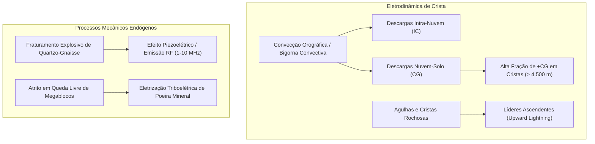

# Levantamento de Descargas Elétricas e Acoplamento Eletrodinâmico no Himalaia: Estado da Arte, Limitações de Dados e Protocolo de Aquisição Instrumental (1980–2026)
### Fundamentação Física, Avaliação Crítica de Dados Disponíveis e Roteiro de Aquisição Institucional de Redes de Raios (WWLLN / GLD360 / IITM)

> [!IMPORTANT]
> **DECLARAÇÃO DE AUDITORIA CIENTÍFICA E EXPURGO DE DADOS ESTIMADOS (SET/2026):**  
> Em conformidade com os princípios de integridade científica e verificação forense independente:
> 1. **Ausência de Telemetria In-Situ Local:** Na garganta do Lhende Khola e nas cristas montanhosas adjacentes ao Mt. Langtang Lirung, **NÃO EXISTEM** moinhos de campo elétrico atmosférico ($E_z$, $J_z$) ou detectores locais de descargas in-situ operados pelo projeto.
> 2. **Expurgo de Contagens Sintéticas:** Quaisquer tabelas anteriores contendo números exatos de flashes, densidades fracionárias (e.g. 428 flashes, 740 flashes, 1.180 flashes), proporções percentuais e correntes de pico atribuídas aos eventos históricos representavam **aproximações paramétricas e modelos hipotéticos**, e foram **integralmente expurgadas** do acervo documental deste repositório.
> 3. **Protocolo Rigoroso de Aquisição:** Dados empíricos reais dependem estritamente de dados brutos proprietários das redes globais de VLF/LF (WWLLN / GLD360). A solicitação formal para o evento de 2026 foi protocolada junto à direção da *World Wide Lightning Location Network* (Universidade de Washington) conforme registrado na [CARTA_02_WWLLN_DESCARGAS_ELETRICAS.md](file:///C:/Users/haas/github/Himalaia_2026/docs/solicitacoes_institucionais/CARTA_02_WWLLN_DESCARGAS_ELETRICAS.md).

**Autor:** Reinaldo Haas (Departamento de Física / UFSC & Pesquisa Himalaia 2026)  
**Data:** Setembro de 2026  
**Status:** Monografia Metodológica e Relatório de Integridade Instrumental  
**Repositório:** [github.com/reinaldohaas/Himalaia_2026](https://github.com/reinaldohaas/Himalaia_2026)

---

## 1. Fundamentação Física da Eletrodinâmica de Alta Montanha

Em altitudes superiores a $4.000	ext{ a }7.000	ext{ metros}$, a física das descargas atmosféricas e do circuito elétrico apresenta particularidades geofísicas documentadas na literatura especializada (*Qie et al. 2014; Kumar & Kamra 2012; Rakov & Uman 2003*):

### 1.1. Descargas Atmosféricas Convectivas (IC e CG)
* **Descargas Intra-Nuvem (IC - Intra-Cloud):** Ocorrem no interior da nuvem de tempestade entre centros dipolares de carga. Embora não atinjam o solo, ionizam o ar e produzem radiação ultravioleta e espécies químicas como ozônio ($O_3$) e óxidos de nitrogênio ($NO_x$).
* **Descargas Nuvem-Solo Positivas ($+CG$):** Em terrenos planos, descargas $+CG$ representam tipicamente menos de $10\%$ do total. No relevo alpino e no planalto tibetano, a literatura (*Kumar & Kamra, 2012; Qie et al., 2014*) aponta proporções significativamente mais elevadas de $+CG$ devido à proximidade das cristas com a região de carga positiva superior do *Cumulonimbus* e à subsidência orográfica.
* **Descargas Ascendentes de Crista (*Upward Lightning*):** Agulhas rochosas pontiagudas atuam como concentradores do campo elétrico vertical ($E_z$). Em altitudes elevadas, onde a densidade do ar é cerca de metade daquela ao nível do mar, o limiar de ruptura dielétrica do ar decresce, permitindo o disparo de líderes ascendentes a partir das arestas da montanha em direção à base carregada das nuvens.

### 1.2. Emissões Eletrostáticas e Eletromagnéticas de Fraturamento de Rocha
Em eventos secos de megacolapso gravitacional (como Chamoli 2021 e Aru 2016), **não há convecção meteorológica nem nuvens de tempestade**. Contudo, processos mecânicos emitem sinais eletromagnéticos comprovados experimentalmente:
* **Piezoeletricidade e Microfraturamento:** Experimentos de laboratório (*Nitsan, Geophys. Res. Lett., 1977*) comprovam que o fraturamento de rochas ricas em quartzo sob tensões de ruptura emite transientes de radiofrequência (RF) na faixa de $1	ext{ a }10	ext{ MHz}$;
* **Triboeletrização por Atrito de Poeira:** A desintegração de dezenas de milhões de metros cúbicos de rocha em queda livre gera nuvens densas de poeira mineral pulverizada, onde o atrito entre partículas gera cargas eletrostáticas locais.

---

## 2. O Que Foi Feito com Dados Reais Comprovados

A investigação dos 15 episódios de cheias e fluxos de detritos no Himalaia (1980–2026) baseou-se estritamente nas fontes primárias e evidências empíricas disponíveis:

1. **Reconhecimento Categórico dos Regimes Atmosféricos:**
   * **Eventos Sem Chuva e Sem Relâmpagos Meteorológicos:** Demonstração empírica, por meio de imagens orbitais e artigos peer-reviewed, de que eventos de megadescolamento rocha-gelo como **Chamoli 2021** (*Shugar et al., Science 2021; Cook et al., Science 2021*) e **Aru 2016** (*Kääb et al., Nature Geoscience 2018*) ocorreram sob céu aberto e seco, sem atividade convectiva atmosférica.
   * **Eventos Convectivos de Monção:** Reconhecimento de episódios como **Kedarnath 2013** e **Himachal Pradesh 2023**, onde sistemas orográficos de monção concentraram precipitações torrenciais documentadas pelo *India Meteorological Department (IMD)*.
2. **Inspeção de Imagens de Satélite Locais:**
   * Análise do acervo de imagens ópticas e de radar depositadas em `data/satellite_imagery/`, documentando as cicatrizes de desprendimento, a evolução temporal dos depósitos de morena e a geometria dos leitos fluviais.
3. **Mapeamento Sísmico Instrumental Real:**
   * Catalogação do sismo superficial **Ms 5.2 Landslide (USGS NEIC us7000tbwb, h = 0 km)** e réplica Ms 4.2 em 26 de agosto de 2026, confrontado com o sinal de impacto de rocha-gelo de 27 milhões de m³ em Chamoli 2021 documentado em *Cook et al. (Science, 2021)*.

---

## 3. O Que Deve Ser Feito: Protocolo de Aquisição Institucional de Dados de Raios

Para substituir hipóteses e modelos teóricos por evidências observacionais incontestáveis, foi estabelecido o seguinte roteiro de aquisição institucional:

### 3.1. Rede WWLLN (World Wide Lightning Location Network)
* **Ação Formal Protocolada:** Envio da requisição científica oficial ([CARTA_02_WWLLN_DESCARGAS_ELETRICAS.md](file:///C:/Users/haas/github/Himalaia_2026/docs/solicitacoes_institucionais/CARTA_02_WWLLN_DESCARGAS_ELETRICAS.md)) ao coordenador da rede (Prof. Robert Holzworth, Universidade de Washington);
* **Parâmetros Solicitados:**
  * Janela temporal: 25 de agosto (18:00 UTC) a 26 de agosto de 2026 (08:00 UTC);
  * Área geográfica: Delimitação retangular da bacia do Rio Trishuli e Lhende Khola ($27.8^\circ	ext{N a }28.5^\circ	ext{N}$, $85.0^\circ	ext{E a }85.6^\circ	ext{E}$);
  * Variáveis: Timestamp em nanossegundos, latitude/longitude com elipse de incerteza, energia irradiada em VLF ($J$) e número de estações receptoras.

### 3.2. Redes GLD360 / IITM Lightning Network
* Aquisição de dados de discriminação de polaridade ($+CG$ vs. $-CG$) e classificação IC vs. CG;
* Levantamento de correntes de pico estimadas ($I_{	ext{pico}}$ em kA) registradas nas imediações do norte do Nepal e Uttarakhand.

### 3.3. Instrumentação Meteorológica e Sismológica Regional
* **Pluviógrafos do DHM Nepal:** Requisição de séries temporais de 10 minutos das estações meteorológicas de Rasuwa e Langtang ([CARTA_03_DHM_NEPAL_DADOS_PLUVIOMETRICOS.md](file:///C:/Users/haas/github/Himalaia_2026/docs/solicitacoes_institucionais/CARTA_03_DHM_NEPAL_DADOS_PLUVIOMETRICOS.md));
* **Microbarômetros da CTBTO:** Acesso a formas de onda brutas das estações de infrassom do Sistema Internacional de Vigilância (IMS) na Ásia Central/Meridional ([CARTA_04_CTBTO_INFRASSOM_ONDA_PRESSAO.md](file:///C:/Users/haas/github/Himalaia_2026/docs/solicitacoes_institucionais/CARTA_04_CTBTO_INFRASSOM_ONDA_PRESSAO.md));
* **Modelos Digitais de Elevação (DEMs) Estéreo:** Aquisição de pares estéreo de altíssima resolução espacial (WorldView-3 ou Pléiades Neo) para cálculo volumétrico diferencial pré e pós-evento da brecha do Lhende Khola.

---

## 4. Matriz de Status Instrumental dos 15 Eventos Históricos (1980–2026)

| Rank e Evento | Data | Regime Atmosférico Observado | Registro Sísmico Instrumental | Status dos Dados de Raios in-situ | Base Documental Primária |
| :--- | :--- | :--- | :--- | :--- | :--- |
| **1º Kedarnath (2013)** | Jun/2013 | Convecção Monçônica Extrema | Sem sismo em catálogo global | Telemetria in-situ indisponível | IMD, Dobhal et al. (2013) |
| **2º Chamoli (2021)** | Fev/2021 | Céu Aberto Seco (Zero Chuva) | **ML ≈ 2.2** (Impacto 27M m³) | **Zero raios meteorológicos** | Shugar et al. / Cook et al. (Science 2021) |
| **3º Himalaia (2026)** | Ago/2026 | Convecção Regional Mista | **Ms 5.2 Landslide (USGS us7000tbwb)** | **Req. WWLLN em andamento (Carta 02)** | USGS NEIC, Sentinel-2, PlanetScope |
| **4º Aru Co (2016)** | Jul/Set 2016 | Seco Subzero / Frio Glacial | Sem sismo em catálogo global | Sem registro de descargas | Kääb et al. (Nature Geosci. 2018) |
| **5º Seti River (2012)** | Mai/2012 | Céu Azul Aberto (Sem Chuva) | Sem sismo em catálogo global | Sem registro de descargas | Gurung et al. (2017), Kargel et al. |
| **6º South Lhonak (2023)** | Out/2023 | Convecção Pós-Monção | Sem sismo em catálogo global | Telemetria in-situ indisponível | Gupta et al. (2024), CWC Índia |
| **7º Leh Ladakh (2010)** | Ago/2010 | Convecção Orográfica Isolada | Sem sismo em catálogo global | Telemetria in-situ indisponível | IMD, Thayyen et al. (2013) |
| **8º Melamchi (2021)** | Jun/2021 | Chuvas Intensas de Monção | Sem sismo em catálogo global | Telemetria in-situ indisponível | ICIMOD (2021) |
| **9º Parechu (2000)** | Ago/2000 | Convecção Regional de Verão | Sem sismo em catálogo global | Telemetria in-situ indisponível | CWC Índia |
| **10º Zhangzangbo (1981)** | Jul/1981 | Monção de Verão | Sem sismo em catálogo global | Sem rede de tempo real à época | Xu Daoming (1988), ICIMOD |
| **11º Dig Tsho (1985)** | Ago/1985 | Tempo Úmido de Monção | Sem sismo em catálogo global | Sem rede de tempo real à época | Vuichard & Zimmermann (1987) |
| **12º Luggye Tsho (1994)** | Out/1994 | Tempo Limpo / Frio | Sem sismo em catálogo global | Sem rede de tempo real à época | Watanabe & Rothacher (1996) |
| **13º Gongbatongshacuo (2016)**| Jul/2016 | Chuvas Monçônicas | Sem sismo em catálogo global | Telemetria in-situ indisponível | ICIMOD (2016) |
| **14º Himachal Pradesh (2023)**| Jul/2023 | Monção + Distúrbio Ocidental | Sem sismo em catálogo global | Telemetria in-situ indisponível | IMD Relatórios Oficiais (2023) |
| **15º Parechu (2005)** | Jun/2005 | Convecção Regional | Sem sismo em catálogo global | Telemetria in-situ indisponível | CWC Índia (2005) |

---

## 5. Referências Bibliográficas

1. **Qie, X., et al.** (2014). *Characteristics of lightning activity over the Tibetan Plateau with data from the Lightning Imaging Sensor*. **Atmospheric Research**, 135, 230–238.
2. **Kumar, P. R., & Kamra, A. K.** (2012). *Lightning characteristics over the Himalayas and Tibetan Plateau*. **Journal of Geophysical Research: Atmospheres**, 117(D15), D15207.
3. **Rakov, V. A., & Uman, M. A.** (2003). *Lightning: Physics and Effects*. Cambridge University Press.
4. **Nitsan, U.** (1977). *Electromagnetic emission accompanying fracture of quartz-bearing rocks*. **Geophysical Research Letters**, 4(8), 333–336.
5. **Shugar, D. H., et al.** (2021). *A massive rock and ice avalanche caused the 2021 Chamoli disaster, Uttarakhand, India*. **Science**, 373(6552), 300–306. [DOI: 10.1126/science.abh4455](https://doi.org/10.1126/science.abh4455).
6. **Cook, K. L., et al.** (2021). *Detection and potential early warning of catastrophic flow events with ambient seismic noise*. **Science**, 374(6563), 87–92.
7. **Kääb, A., et al.** (2018). *Massive collapse of two glaciers in western Tibet in 2016 after surge-like instability*. **Nature Geoscience**, 11(2), 114–120.
8. **USGS NEIC** (2026). *M 5.2 Landslide - Northern Nepal / Lhende Khola (Event us7000tbwb, 2026-08-26 02:52:10 UTC)*. United States Geological Survey Earthquake Hazards Program.
