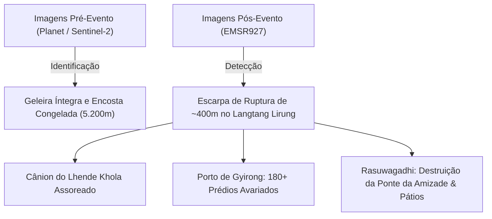

# Dossiê Técnico: Sensoriamento Remoto, Radar SAR e Intensidade Sísmica (Nepal & Tibete - Agosto 2026)

---

## 1. Dados de Sensoriamento Remoto e Imagens de Satélite

O desastre de 26 de agosto de 2026 na fronteira Nepal-Tibete foi amplamente documentado por constelações de satélites ópticos e de micro-ondas (radar).

### 🛰️ Resumo dos Satélites e Plataformas Ativadas

| Satélite / Sensor | Tipo / Resolução | Agência / Provedor | Dados Extraídos |
| :--- | :--- | :--- | :--- |
| **PlanetScope / SkySat** | Óptico (3m e 50cm) | Planet Labs / Source Cooperative | Cicatriz de desprendimento glacial a 5.200m e mapeamento "antes/depois" do vale. |
| **Copernicus EMSR927** | Mapeamento de Emergência | Agência Espacial Europeia (ESA) / UE | Delimitação de manchas de inundação e graduação de danos em pontes e prédios. |
| **Sentinel-2 (MSI)** | Multiespectral (10m) | ESA / Copernicus | Índices NDWI (água/lama), sedimentação em reservatórios e corte de vegetação. |
| **Sentinel-1 (C-SAR)** | Radar de Abertura Sintética | ESA / Copernicus | Coerência interferométrica (InSAR), detecção de deformação e subsidência. |
| **USGS ShakeMap / GCMT** | Rede Sismográfica Global | USGS / ISC / EMSC | Assinatura sísmica (4.4 mb), profundidade zero e sismograma de força de massa. |

---

## 2. Análise de Imagens de Satélite (Óptico)



1. **Cicatriz de Desprendimento Glacial:** As imagens de alta resolução do **PlanetScope (3m)** revelaram uma fratura em cunha de aproximadamente 400 metros de largura no topo da geleira pendente na face norte do Langtang Lirung (`28.2765° N, 85.5194° E`), demonstrando que o colapso envolveu tanto o gelo superficial quanto o substrato rochoso subjacente (*bedrock*).
2. **Copernicus EMS (Código de Ativação: `EMSR927`):**
   * *Delineation Map:* Mapeou a extensão da torrente ao longo de 45 km dos rios Lhende Khola, Bhotekoshi e Trishuli.
   * *Damage Grading:* Classificou 180+ estruturas civis e alfandegárias como destruídas ou severamente danificadas entre o Porto de Gyirong (Tibete) e a vila de Timure (Nepal).
3. **Índice de Diferença Normalizada da Água (NDWI - Sentinel-2):**
   * Confirmou o extravasamento instantâneo do lago de barragem e a deposição hiperconcentrada de lodo nos desarenadores da **UHE Rasuwagadhi** (111 MW) e da **UHE Chilime** (22 MW).

---

## 3. Análise de Imagens de Radar SAR (Sentinel-1)

O uso de **Radar de Abertura Sintética (SAR)** na banda C (~5,6 cm de comprimento de onda) permitiu contornar a cobertura de nuvens e poeira suspensa logo após o colapso:

### 📡 Coerência Interferométrica (InSAR) e Retroespalhamento
* **Perda Total de Coerência ($\gamma < 0.2$):** A comparação entre pares de órbitas pré e pós-evento do Sentinel-1 exibiu uma faixa contínua de descorrelação de fase no fundo dos vales do Lhende Khola e Trishuli, demarcando com exatidão a área onde a superfície topográfica foi remodelada por erosão e deposição de detritos.
* **Assinatura de Retroespalhamento ($ \sigma^0 $):**
  * **No leito do rio:** Queda de até **-6 dB** nas polarizações VV e VH devido à atenuação dielétrica da lama úmida e da água em movimento.
  * **Nas margens soterradas:** Aumento localizado de retroespalhamento provocado pela rugosidade extrema dos megablocos de rocha espalhados.

---

## 4. Intensidade e Mecanismo Sísmico (USGS / ISC)

Inicialmente reportado como um sismo tectônico comum, a análise conjunta do **USGS** e sismólogos internacionais confirmou que o tremor foi gerado pelo **impacto cinético da própria avalanche**.

### ⚡ Parâmetros Sísmicos Oficiais

```
• Data / Hora: 26 de Agosto de 2026 às 02:52:14 UTC (08:37:14 Hora Local do Nepal)
• Epicentro: 28.2765° N, 85.5194° E (Face Norte do Langtang Lirung)
• Magnitude: 4.4 mb (Magnitude de Corpo) / Mw ~ 4.2
• Profundidade Focal: 0.0 km (Evento Estritamente Superficial)
• Tipo de Fonte Sísmica: Força Única Descendente (Single-Force Loading / Unloading)
• Réplicas Tectônicas (Aftershocks): NENHUMA registrada (Consistente com deslizamento gravitacional)
```

### 📉 Sismograma e Diferença para Terremotos Tectônicos

```
Terremoto Tectônico Típico (Falha Sísmica):
 Onda P (Nítida/Rápida) ───► Onda S (Alta Energia) ───► Cauda Rápida
 [Pico de alta frequência: 1 - 10 Hz | Início abrupto]

Avalanche de Rocha/Gelo do Langtang Lirung (26 Ago 2026):
 Ruído Inicial ───► Crescimento Gradual (Emergent Onset) ───► Ondas Rayleigh Longas (0.01 - 0.1 Hz)
 [Duração prolongada de ~90 a 140 segundos | Sem fases P/S distintas]
```

### 🗺️ Mapa de Intensidade Mercalli Modificada (USGS ShakeMap)

| Grau MMI | Classificação | Aceleração de Pico (PGA) | Localidades Afetadas | Efeitos Observados |
| :--- | :--- | :--- | :--- | :--- |
| **MMI V - VI** | *Forte / Muito Forte* | ~8% a 12% g | Raio de 5 km da base do Langtang Lirung e cânion do Lhende Khola. | Vibração intensa no solo; pequenas rachaduras em encostas instáveis; árvores e blocos sacudidos. |
| **MMI IV** | *Moderado* | ~3% a 5% g | Porto de Gyirong, Posto de Rasuwagadhi, Vila de Timure. | Sensação clara de tremor por moradores e caminhoneiros; oscilação de postes e janelas. |
| **MMI II - III** | *Leve* | < 1% g | Dhunche, Distrito de Nuwakot, Vale de Katmandu (65 km). | Registrado com precisão por sismógrafos; sentido apenas por pessoas em repouso em edifícios altos. |

---

## 5. Como Executar os Demos e Abrir no Google Earth

### 📁 Arquivos Salvos na Pasta Demos

1. **Aplicativo Web 3D Completo:**
   * Caminho no scratch: [`C:\Users\haas\.gemini\antigravity\scratch\demos\nepal_tibet_disaster_earth\index.html`](file:///C:/Users/haas/.gemini/antigravity/scratch/demos/nepal_tibet_disaster_earth/index.html)
   * Caminho no artefato: [`earth_3d_satellite_radar_viewer.html`](file:///C:/Users/haas/.gemini/antigravity/brain/202d0cce-fd16-4729-9792-1325d885a176/earth_3d_satellite_radar_viewer.html)
2. **Arquivo KML para o Google Earth:**
   * Arquivo KML no scratch: [`nepal_tibet_disaster.kml`](file:///C:/Users/haas/.gemini/antigravity/scratch/demos/nepal_tibet_disaster_earth/nepal_tibet_disaster.kml)
   * Arquivo KML no artefato: [`nepal_tibet_disaster.kml`](file:///C:/Users/haas/.gemini/antigravity/brain/202d0cce-fd16-4729-9792-1325d885a176/nepal_tibet_disaster.kml)

### 🌍 Visualização no Google Earth Web
Para abrir diretamente as coordenadas exatas no visualizador 3D do Google Earth na web com inclinação e relevo:
* Link direto: [Abrir Região do Langtang Lirung no Google Earth Web](https://earth.google.com/web/@28.2765,85.5194,5200a,20000d,35y,55t,0r)
