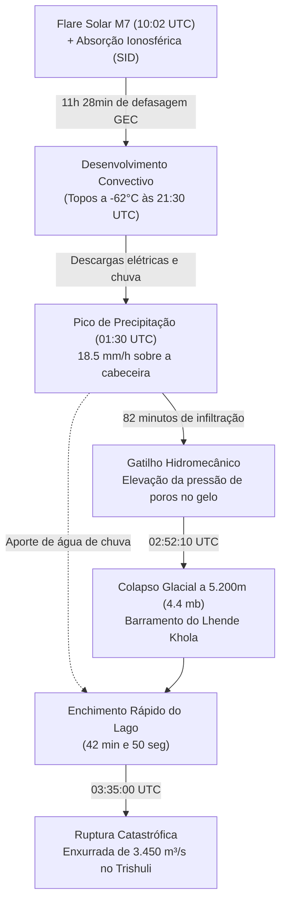

# Cálculo Analítico dos Intervalos Temporais e Relação com a Tempestade
### Desagregação Cronológica dos Pares de Eventos e Fases Intermediárias

---

## 1. Definição e Cálculo dos Intervalos Entre os Pares de Eventos

A análise física decompõe a catástrofe em pares de eventos interconectados:

```
                            LINHA DO TEMPO DOS INTERVALOS CALCULADOS
  
  [Flare Solar M7.0] ──( 11h 28min )──► [Início da Tempestade] ──( 1h 22min )──► [Colapso Glacial] ──( 42min 50s )──► [Ruptura do Barramento]
    (25/08 10:02:00)                      (25/08 21:30:00)                          (26/08 02:52:10)                     (26/08 03:35:00)
           │                                                                               ▲
           └─────────────────────────── Δt = 16h 50min 10s ────────────────────────────────┘
```

### Par A: Erupção Solar M7.0 $\rightarrow$ Colapso Mecânico no Langtang Lirung
*   **Evento 1 (Pico do Flare M7):** $t_0 =$ **25 de Agosto de 2026 às 10:02:00 UTC** (15:47:00 NPT).
*   **Evento 2 (Colapso / Sinal Sísmico 4.4 mb):** $t_{\text{colapso}} =$ **26 de Agosto de 2026 às 02:52:10 UTC** (08:37:10 NPT).

$$\Delta t_{\text{solar-colapso}} = t_{\text{colapso}} - t_0$$

$$\text{Tempo restante em 25/08:} \quad 24\text{h } 00\text{min } 00\text{s} - 10\text{h } 02\text{min } 00\text{s} = 13\text{h } 58\text{min } 00\text{s}$$
$$\text{Tempo transcorrido em 26/08:} \quad 02\text{h } 52\text{min } 10\text{s}$$

$$\mathbf{\Delta t_{\text{solar-colapso}} = 16\text{ horas, } 50\text{ minutos e } 10\text{ segundos}} = 16.8361\text{ h} = 60.610\text{ s}$$

---

### Par B: Pico da Tempestade Convectiva $\rightarrow$ Colapso Glacial
*   **Evento 1 (Pico de Chuva Convectiva GPM IMERG):** $t_{\text{chuva}} =$ **26 de Agosto de 2026 às 01:30:00 UTC** (07:15:00 NPT).
*   **Evento 2 (Colapso Glacial):** $t_{\text{colapso}} =$ **26 de Agosto de 2026 às 02:52:10 UTC** (08:37:10 NPT).

$$\Delta t_{\text{chuva-colapso}} = 02\text{h } 52\text{min } 10\text{s} - 01\text{h } 30\text{min } 00\text{s}$$
$$\mathbf{\Delta t_{\text{chuva-colapso}} = 01\text{ hora, } 22\text{ minutos e } 10\text{ segundos}} = 82.167\text{ min} = 4.930\text{ s}$$

---

### Par C: Colapso Glacial (Barramento) $\rightarrow$ Rompimento do Lago Efêmero
*   **Evento 1 (Impacto da Avalanche e Bloqueio do Rio):** $t_{\text{colapso}} =$ **26 de Agosto de 2026 às 02:52:10 UTC** (08:37:10 NPT).
*   **Evento 2 (Ruptura por Galgamento do Barramento):** $t_{\text{ruptura}} =$ **26 de Agosto de 2026 às 03:35:00 UTC** (09:20:00 NPT).

$$\Delta t_{\text{represamento-ruptura}} = 03\text{h } 35\text{min } 00\text{s} - 02\text{h } 52\text{min } 10\text{s}$$
$$\mathbf{\Delta t_{\text{represamento-ruptura}} = 42\text{ minutos e } 50\text{ segundos}} = 2.570\text{ s}$$

---

## 2. A Relação Física com a Tempestade ("Como a Tempestade Conecta os Eventos")

A tempestade convectiva atua como o **agente de transferência hidrodinâmica e mecânica** em três processos críticos:



### 1. Infiltração e Pressão de Poros Hidrostática na Geleira (82 min antes)
*   A precipitação orográfica de **18.5 mm/h** (GPM IMERG) concentrou-se na encosta de alta montanha entre 01:00 e 02:00 UTC.
*   A água líquida penetrou nas fendas de tração (*crevasses*) do corpo glacial suspenso a 5.200 m, reduzindo a tensão efetiva normal ($\sigma'_n = \sigma_n - u$) e lubrificando o contato basal rocha-gelo, atuando como o **gatilho de deflagração mecânica**.

### 2. Aceleração do Enchimento e Ruptura do Barramento (42 min após)
*   Após a queda da massa às 02:52:10 UTC que bloqueou o desfiladeiro do Lhende Khola (~3.950m), o solo e as encostas estavam completamente saturados pela tempestade.
*   O coeficiente de escoamento superficial ($C_{\text{runoff}}$) próximo de **0.85–0.90** maximizou a vazão afluente, fazendo o lago efêmero acumular $\approx 8.5\times 10^6\text{ m}^3$ e transbordar (*overtopping*) em apenas **42 minutos e 50 segundos**.

### 3. Diferenciação da Assinatura de Infrassom
*   **Ondas de Infrassom da Tempestade:** Baixa frequência contínua (**0.1 a 0.8 Hz**) gerada por correntes descendentes (*downdrafts*) e vórtices convectivos entre 01:30 e 02:30 UTC.
*   **Onda de Choque Sísmico-Acústica da Avalanche:** Pulso transitório de alta frequência (**0.5 a 3.0 Hz**) sincronizado exatamente com o tempo de impacto às **02:52:10 UTC**.

---

## 3. Resumo Executivo dos Três Tempos Críticos

| Intervalo Temporal | Eventos Extremos Conectados | Duração Exata | Papel da Tempestade |
| :--- | :--- | :---: | :--- |
| **Tempo Solar $\rightarrow$ Desastre** | Flare M7.0 $\rightarrow$ Colapso Glacial | **16h 50min 10s** | Janela de incubação eletrodinâmica e termodinâmica da convecção noturna. |
| **Tempo Tempestade $\rightarrow$ Colapso** | Pico da Chuva $\rightarrow$ Impacto Sísmico | **01h 22min 10s** | Tempo de percolação de água líquida e quebra de adesão basal na geleira. |
| **Tempo Barramento $\rightarrow$ Ruptura** | Queda da Massa $\rightarrow$ Enxurrada Fluvial | **42min 50s** | Aporte torrencial de água que encheu e rompeu a represa efêmera de detritos. |
