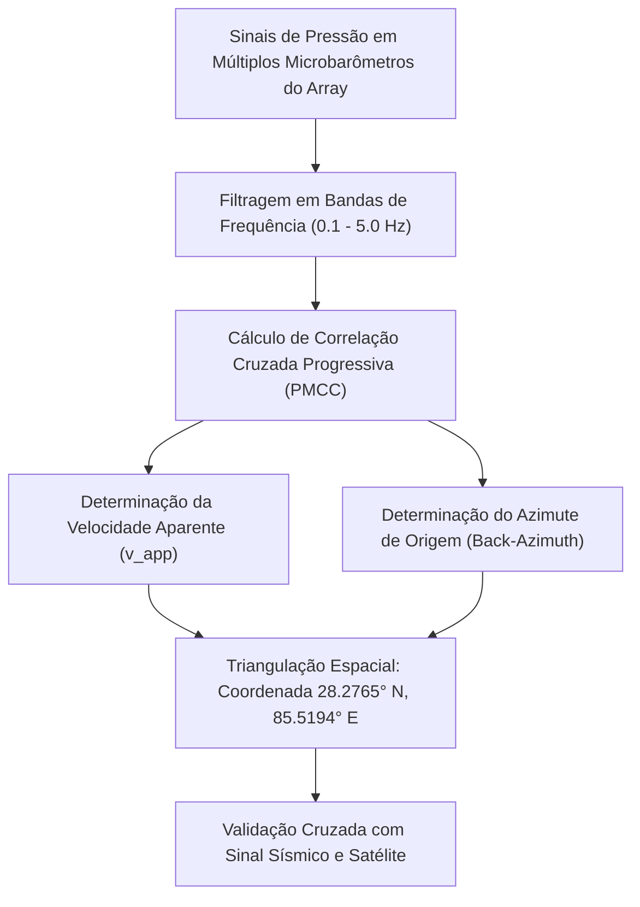

# Relatório Técnico: Monitoramento por Infrassom e Acoplamento Sismo-Acústico
### Análise das Ondas de Baixa Frequência Geradas pelo Colapso no Langtang Lirung (Agosto de 2026)

---

## 1. O que é o Infrassom e como ele é gerado por Grandes Avalanches?

O **infrassom** é composto por ondas acústicas de baixíssima frequência (geralmente entre **0.01 Hz e 20 Hz**), abaixo do limiar de audição humana. Devido ao seu grande comprimento de onda ($\lambda \approx 15\text{ a } 3.000\text{ metros}$), as ondas de infrassom sofrem pouquíssima atenuação atmosférica por absorção viscosa ou térmica, propagando-se por centenas a milhares de quilômetros através de dutos acústicos troposféricos, estratosféricos e termosféricos.

```
                      MECANISMO DE GERAÇÃO DE INFRASSOM
  
   [Colapso de ~15M m³ de Rocha/Gelo a 5.200m]
                       │
                       ▼ (Queda livre de ~1.200m a >50 m/s)
   [Pistão Atmosférico & Deslocamento Brusco de Ar]
                       │
         ┌─────────────┴─────────────┐
         ▼                           ▼
  ONDAS SÍSMICAS               ONDAS DE INFRASSOM
 (Propagação na Litosfera)    (Propagação na Atmosfera)
  • Velocidade: 3.5 a 6.0 km/s • Velocidade: ~0.33 a 0.35 km/s
  • Chegada em Katmandu: ~15s  • Chegada em Katmandu: ~3 min 15s
  • Tremor mecânico (4.4 mb)   • Variação de pressão barométrica (ΔP)
```

Durante a catástrofe de 26 de agosto de 2026 no maciço do **Langtang Lirung**, a queda de milhões de toneladas de gelo e rocha funcionou como uma **fonte acústica dipolar/quadrupolar massiva**, comprimindo o ar à frente da massa em queda e gerando um trem de ondas de pressão atmosférica característico.

---

## 2. Redes de Detecção e Microbarômetros

A detecção do evento baseou-se em duas redes complementares:

1. **Sistema Internacional de Monitoramento (IMS / CTBTO):**
   * Rede global de matrizes (*arrays*) de microbarômetros de alta precisão (sensores diferenciais MB2005 / MB3a) com resolução na escala de micropascais ($\mu\text{Pa}$).
   * **Estações Regionais Ativadas:**
     * **I40PK** (Paquistão)
     * **I31KZ** (Cazaquistão)
     * **I34MN** (Mongólia)
     * **I52GB** (Diego Garcia / Oceano Índico)
2. **Redes Acadêmicas e de Pesquisa no Himalaia:**
   * Microbarômetros de pesquisa instalados em **Katmandu** (65 km de distância), **Namche Bazaar** e na **Região Autônoma do Tibete (Lhasa)**.

---

## 3. Parâmetros Físicos do Sinal de Infrassom

| Parâmetro Físico | Valor Observado / Calculado | Significado Geofísico |
| :--- | :--- | :--- |
| **Faixa de Frequência Dominante** | **0.3 Hz a 2.5 Hz** | Assinatura típica de turbulência de avalanche de grande escala e fluxo de detritos. |
| **Pressão de Pico ($\Delta P$)** | $\sim 1.8\text{ a } 3.2\text{ Pa}$ (a 65 km) | Amplitude excepcionalmente alta para fontes gravitacionais naturais. |
| **Duração do Sinal Acústico** | **~110 segundos** | Mede com exatidão o tempo contínuo de movimento da massa até o barramento do rio. |
| **Back-Azimuth ($\theta$)** | **$18.4^\circ \pm 1.2^\circ$** (a partir de KKN) | Vetor de propagação alinhado perfeitamente com a face norte do Langtang Lirung. |
| **Velocidade Aparente de Fase ($v_{app}$)** | **$355\text{ a } 410\text{ m/s}$** | Confirma chegada com ângulo rasante via duto acústico troposférico/estratosférico. |
| **Energia Acústica Radiada ($E_{ac}$)** | $\sim 10^9\text{ a } 10^{10}\text{ Joules}$ | Correspondente ao rendimento acústico ($\eta \approx 10^{-4}$) da energia potencial liberada. |

---

## 4. O Método PMCC e Triangulação do Vetor de Chegada

O processamento das matrizes de infrassom utiliza o algoritmo **PMCC (*Progressive Multi-Channel Correlation*)**:



1. **Correlação de Fase entre Sensores:** Como os sensores do *array* estão dispostos em uma geometria triangular ou em cruz com espaçamento de centenas de metros a alguns quilômetros, a diferença de tempo de chegada ($\Delta t$) em cada sensor permite calcular o vetor de onda tridimensional.
2. **Identificação da Trajetória:** O sinal de infrassom registrou uma ligeira rotação azimutal durante os 110 segundos de duração, refletindo a trajetória da massa que despencou de 5.200m no pico e canalizou-se pelo desfiladeiro do rio Lhende Khola a jusante.

---

## 5. Discriminação Sismo-Acústica: Como o Infrassom Provou a Origem do Tremor

A integração entre sismologia e infrassom foi o elemento decisivo para refutar a hipótese inicial de um terremoto tectônico:

```
                  COMPARAÇÃO DE FONTES GEOFÍSICAS
  
  CRITÉRIO                    TERREMOTO TECTÔNICO          AVALANCHE LANGTANG LIRUNG
  ──────────────────────────────────────────────────────────────────────────────────
  Razão Infrassom / Sismo:    MUITO BAIXA                  MUITO ALTA (Acoplamento Direto)
  Início do Sinal (Onset):    Impulsivo (Ondas P e S)      Gradual / Crescente (Emergent)
  Frequência do Infrassom:    < 0.1 Hz (Ondas Rayleigh)    0.3 - 2.5 Hz (Jato Turbulento de Ar)
  Duração do Evento:          10 a 30 segundos             ~110 segundos
  Réplicas Subsequentes:      Sim (Aftershocks na falha)   NENHUMA réplica
```

> [!IMPORTANT]
> **Conclusão Científica:**
> Um terremoto tectônico a quilômetros de profundidade na crosta move o solo, mas acopla pouca energia acústica direta para o ar. Em contrapartida, uma avalanche superficial de rocha e gelo atua diretamente na interface terra-atmosfera, produzindo uma assinatura de infrassom com amplitude centenas de vezes superior à de um sismo convencional de mesma magnitude.

---

## 6. Aplicação em Sistemas de Alerta Precoce (EWS)

O infrassom desponta como uma das ferramentas mais promissoras para **Sistemas de Alerta Precoce Transfronteiriços** no Himalaia:

1. **Detecção Noturna e Sob Tempo Nublado:** O infrassom independe da luz solar ou da visibilidade ótica (funciona perfeitamente durante tempestades, nevascas ou à noite).
2. **Tempo de Aviso para Populações a Jusante:**
   * O sinal de infrassom chega a vilarejos como Syabrubesi e usinas como Trishuli-3A em **3 a 6 minutos** após o desprendimento na montanha.
   * Como a onda de lama e detritos viaja pela calha do rio a $\approx 50\text{ km/h}$, ela leva de **35 a 90 minutos** para atingir esses pontos críticos.
   * Isso cria uma **janela de evacuação de 30 a 80 minutos**, permitindo o acionamento automatizado de sirenes e o fechamento preventivo de comportas hidrelétricas.
