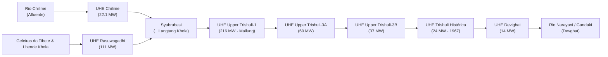

# Monografia Técnica: A Bacia Hidrográfica do Rio Trishuli
### Hidrologia, Cascata Energética, Vulnerabilidade a Perigos Glaciais e Geopolítica Transfronteiriça

---

## 1. Visão Geral e Geografia Transfronteiriça

O **Rio Trishuli** (em nepalês: त्रिशूली नदी; no Tibete: *Gyirong Tsangpo* / *Kyirong Tsangpo*) é um dos rios mais dinâmicos, estrategicamente vitais e geologicamente ativos do Himalaia Central. Trata-se de um curso d'água **transfronteiriço antecedente** que nasce no Platô Tibetano (China), atravessa a crista principal da Grande Cordilheira do Himalaia e desce em desfiladeiros íngremes através do território do Nepal até desaguar na bacia do Rio Gandaki (Narayani).

```
                            PERFIL LONGITUDINAL DO RIO TRISHULI
  
  Altitude (m)
  7.000m ──┐ [Maciço Langtang / Shishapangma - Glaciares de Cabeceira]
           │
  5.000m ──┼──► Platô Tibetano / Rio Lhende Khola (China)
           │      \
  3.000m ──┼───────► Garganta de Gyirong (2.700m)
           │          \
  1.800m ──┼───────────► Rasuwagadhi (Fronteira China-Nepal / 1.814m)
           │              \  [UHE Rasuwagadhi 111 MW]
  1.400m ──┼───────────────► Syabrubesi (+ Langtang Khola / 1.460m)
           │                  \
  1.000m ──┼───────────────────► Mailung / Dhunche [UHE Upper Trishuli-1 216 MW]
           │                      \
    800m ──┼───────────────────────► Betrawati / Nuwakot [UHE Trishuli-3A 60 MW]
           │                          \
    200m ──┴───────────────────────────► Devghat / Confluência com Kali Gandaki (Narayani)
           0km                        50km                      120km                 200km
```

### 📍 Dados Morfométricos e Hidrológicos

| Parâmetro | Valor / Descrição |
| :--- | :--- |
| **Origem Geográfica** | Geleiras do Condado de Gyirong, Região Autônoma do Tibete (China) a >5.500 m. |
| **Entrada no Nepal** | Garganta de Rasuwagadhi (Distrito de Rasuwa), cota 1.814 m. |
| **Foz / Exutório** | Encontro com o Rio Kali Gandaki em **Devghat** (formando o Rio Narayani / Gandaki). |
| **Comprimento Total** | ~200 km (sendo ~70 km no Tibete e ~130 km no Nepal). |
| **Área de Drenagem** | ~4.640 km² na bacia superior/média (incluindo ~2.000 km² em território tibetano). |
| **Vazão Média Anual** | ~170 a 220 m³/s (com picos de monção superiores a 1.200 m³/s e cheias extremas >3.500 m³/s). |
| **Gradiente Hidráulico Médio** | ~25 a 45 m/km (atingindo extremos de mais de 100 m/km nas gargantas superiores). |

---

## 2. A "Espinha Dorsal Energética" do Nepal: A Cascata Hidrelétrica

Devido ao desnível topográfico violento e à alimentação contínua por degelo e monções, a calha do Trishuli é o corredor hidrelétrico mais densamente aproveitado do Nepal, somando **mais de 1.200 MW** em projetos operacionais, em obras e planejados.



### Principais Usinas Hidrelétricas ao Longo do Rio

| Usina Hidrelétrica (HEP) | Capacidade | Status | Cota / Localização | Vulnerabilidade Principal |
| :--- | :---: | :---: | :--- | :--- |
| **Rasuwagadhi HEP** | **111 MW** | Operacional | 1.780 m (Bhote Koshi / Rasuwa) | Inundação direta por eventos transfronteiriços no Lhende Khola e Tibet. |
| **Chilime HEP** | **22.1 MW** | Operacional | 1.550 m (Afluente Chilime Khola) | Assoreamento e remanso de cheia do Trishuli. |
| **Upper Sanjen / Sanjen** | **57.3 MW** | Operacional | Alta encosta de Rasuwa | Deslizamentos em encostas íngremes. |
| **Upper Trishuli-1** | **216 MW** | Em Construção | Mailung / Haku (Rasuwa) | Área de alta sismicidade (epicentro do terremoto de 2015). |
| **Upper Trishuli-3A** | **60 MW** | Operacional | 850 m (Nuwakot) | Alta carga de sedimentos e desgaste de turbinas. |
| **Upper Trishuli-3B** | **37 MW** | Em Obras | Cascata abaixo de 3A (Nuwakot) | Flutuações bruscas de vazão a montante. |
| **Trishuli HEP** | **24 MW** | Operacional | Bidur (Construída em 1967) | Projeto clássico financiado pelo governo da Índia. |
| **Devighat HEP** | **14 MW** | Operacional | Bidur / Nuwakot (1984) | Aproveitamento das águas turbinadas de Trishuli. |

---

## 3. Dinâmica de Perigos Naturais e Vulnerabilidade Geológica

O Rio Trishuli corre ao longo de zonas de falhas geológicas ativas no Himalaia, incluindo o **Main Central Thrust (MCT)**. A bacia é propensa a um regime complexo de múltiplos perigos naturais (*Multi-Hazard Environment*):

### 1. Inundações por Ruptura de Lagos Glaciais (GLOFs) e Avalanches
* Existem mais de 70 lagos glaciais catalogados na porção tibetana e nas altas cabeceiras de Langtang que drenam para a bacia do Trishuli.
* O colapso de morenas glaciais ou o desprendimento de geleiras pendentes (como ocorrido na face norte do Langtang Lirung em agosto de 2026) gera ondas de choque hiperconcentradas (*debris flows*) que percorrem dezenas de quilômetros ao longo do vale.

### 2. Abrasão por Sedimentos Quartzíticos
* As rochas do maciço de Langtang são formadas por gnaisses, granitos e quartzitos de alta dureza (Escala de Mohs $\ge 7$).
* Durante o período das monções (junho a setembro), o Trishuli transporta milhões de toneladas de sedimentos finos em suspensão, que agem como lixa nas pás das turbinas hidrelétricas Francis e Pelton, exigindo bacias de desarenação de alta capacidade e revestimentos cerâmicos especiais (*HVOF - High Velocity Oxy-Fuel*).

### 3. Instabilidade Sísmica e Deslizamentos
* O Terremoto de Gorkha de 2015 ($M_w 7.8$) teve seu eixo de ruptura cruzando a bacia do Trishuli, deflagrando milhares de deslizamentos de terra que bloquearam o curso do rio em diversos pontos, destruíram vilas inteiras (como Mailung e Ramche) e soterraram estradas de acesso.

---

## 4. Importância Logística e Geopolítica

```
                CORREDOR ESTRATÉGICO TRANS-HIMALAIO
  
  [China / Platô Tibetano (Lhasa / Shigatse)]
                     │
                     ▼ (Rodovia Nacional G216)
         [Porto Terrestre de Gyirong]
                     │
       ──────────────┼────────────── (Fronteira Internacional)
                     ▼
         [Forte de Rasuwagadhi]
                     │
                     ▼ (Rodovia Pasang Lhamu / Vale do Trishuli)
         [Syabrubesi ──► Dhunche ──► Galchhi ──► KATMANDU]
```

* **Rodovia Pasang Lhamu:** Acompanha o vale do Trishuli e constitui a principal artéria de comércio terrestre entre o Nepal e a China, especialmente após o fechamento temporário da passagem de Tatopani/Kodari em 2015.
* **Projetos Ferroviários Trans-Himalaios:** O traçado projetado para a futura ferrovia China-Nepal (Lhasa–Gyirong–Katmandu) tem o desfiladeiro do Rio Trishuli como principal corredor de descida através da cordilheira.

---

## 5. Dimensão Cultural, Mítica e Turística

* **Etimologia Sagrada (*O Tridente de Shiva*):** Na mitologia hindu, o nome *Trishuli* deriva de *Trishula* (o tridente sagrado do deus Shiva). A lenda conta que Shiva cravou seu tridente no alto das montanhas nevadas para abrir fontes de água límpida e aplacar a queimação em sua garganta após engolir o veneno cósmico *Halahala* para salvar o universo. Essa nascente sagrada formou os lagos de altitude de **Gosaikunda** (4.380 m), cujas águas vertem diretamente para a bacia do Trishuli.
* **Rafting e Esportes Radicais:** O Rio Trishuli é mundialmente reconhecido como o principal rio de **rafting e caiaque de corredeiras** do Nepal (graus III a IV+), com fácil acesso a partir da rodovia Prithvi conectando Katmandu a Pokhara.
