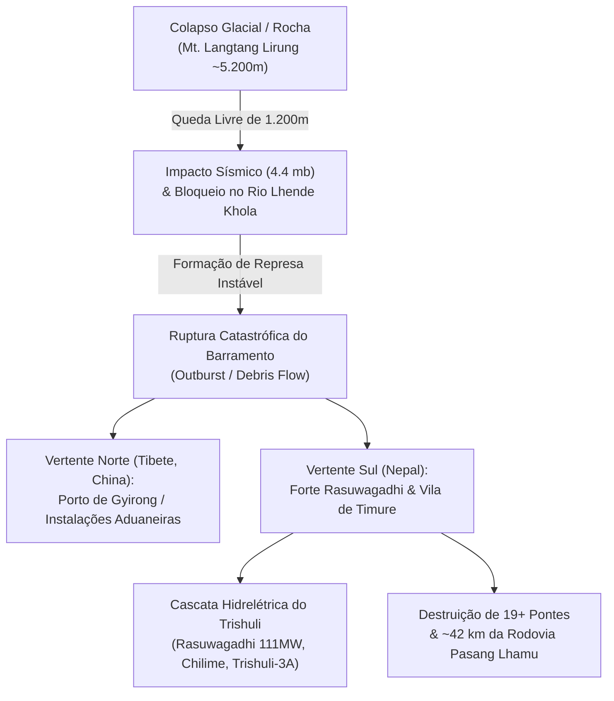

# Relatório Técnico: Catástrofe Transfronteiriça de Avalanche e Inundação (Nepal & Tibete - Agosto de 2026)

---

## 1. Resumo Executivo

No dia **26 de agosto de 2026**, uma massiva avalanche de rocha e gelo na face norte do maciço do **Langtang Lirung** (7.245 m) desencadeou um dos desastres fluvio-glaciais mais destrutivos das últimas décadas na fronteira entre o **Nepal** (Distrito de Rasuwa) e a **China / Tibete** (Condado de Gyirong).

O volume estimado de vários milhões de metros cúbicos de material colapsou a partir de aproximadamente **5.200 metros de altitude**, despencando cerca de 1.200 metros em queda livre sobre o cânion do rio **Lhende Khola**. O impacto inicial provocou um sinal sísmico de **magnitude 4.4 mb** e formou uma represa natural instável de detritos. Minutos depois, o barramento sofreu ruptura catastrófica, liberando uma onda de choque de água, lama e megablocos que varreu mais de **45 km de calha fluvial** através das bacias do **Bhote Koshi** e **Rio Trishuli**.

---

## 2. Dados Geográficos e Coordenadas dos Pontos de Impacto

| Ponto / Localidade | Jurisdição | Coordenadas | Altitude | Tipo de Impacto / Dano Registrado |
| :--- | :--- | :--- | :--- | :--- |
| **Origem do Colapso Glacial** | Vertente Norte do Langtang Lirung | `28.2765° N, 85.5194° E` | ~5.200 m | Desprendimento de bloco de gelo e rocha (~1.200 m de queda). |
| **Garganta do Rio Lhende Khola** | Linha de Fronteira | `28.2740° N, 85.4800° E` | ~3.950 m | Barramento temporário de detritos e rompimento súbito. |
| **Porto de Gyirong (Jilong)** | Tibete (China) | `28.3970° N, 85.3300° E` | ~2.700 m | Complexo alfandegário soterrado por lama; vias cortadas. |
| **Forte & Aduana de Rasuwagadhi** | Rasuwa (Nepal) | `28.2730° N, 85.3810° E` | ~1.814 m | Ponte da Amizade e pátios aduaneiros totalmente destruídos. |
| **UHE Rasuwagadhi (111 MW)** | Rio Bhotekoshi (Nepal) | `28.2650° N, 85.3780° E` | ~1.780 m | Inundação severa da casa de força e desarenadores; parada total. |
| **Vila de Timure** | Rasuwa (Nepal) | `28.2520° N, 85.3850° E` | ~1.750 m | Soterramento de dezenas de residências, hotéis e caminhões. |
| **UHE Chilime (22 MW)** | Rio Chilime / Trishuli | `28.1880° N, 85.3050° E` | ~1.550 m | Assoreamento crítico e abertura de emergência de comportas. |
| **Syabrubesi** | Rasuwa (Nepal) | `28.1610° N, 85.3370° E` | ~1.460 m | Pontes de acesso rompidas; isolamento de equipes e turistas. |
| **Dhunche** | Rasuwa (Nepal) | `28.1130° N, 85.3000° E` | ~2.030 m | Base de comando de operações conjuntas e atendimento médico. |
| **UHE Upper Trishuli-3A (60 MW)** | Nuwakot (Nepal) | `27.9700° N, 85.1800° E` | ~850 m | Pico de cheia atinge barragem; sobrecarga de sedimentos. |

---

## 3. Linha do Tempo da Catástrofe (26 de Agosto de 2026)

*   **08:37 (Hora do Nepal / UTC+5:45):** 
    Desprendimento abrupto de massa de gelo e rocha a 5.200 m de altitude na parede norte do Langtang Lirung. Sensores sismológicos globais (incluindo USGS) registram um abalo de **4.4 mb**, atribuído à violenta liberação de energia potencial e impacto com o leito do vale.
*   **08:50:** 
    A massa de sedimentos represa o curso do rio **Lhende Khola** em um desfiladeiro estreito, represando rapidamente um lago efêmero sob condições de alta pressão hidrostática.
*   **09:15:** 
    Colapso catastrófico da barragem de detritos. A onda de choque inicial avança a velocidades estimadas entre **45 e 60 km/h**, transportando matacões de granito com diâmetros superiores a 4 metros.
*   **09:35 - 09:50:** 
    A torrente atinge o complexo de fronteira de **Gyirong** (lado tibetano) e **Rasuwagadhi / Timure** (lado nepalês). A infraestrutura aduaneira e veículos de transporte de carga são varridos.
*   **10:15 - 11:30:** 
    A onda propaga-se pelo rio Trishuli, inundando as obras da **UHE Rasuwagadhi** (111 MW) e atingindo **Syabrubesi** e **Nuwakot**, forçando o desligamento em cascata de mais de **400 MW** do Sistema Interligado do Nepal.

---

## 4. Diagnóstico Físico e Glaciológico

> [!IMPORTANT]
> **O Fenômeno do "Terceiro Polo" e o Colapso do Permafrost**
> A região do Himalaia e do Platô Tibetano aquece a um ritmo até **3 vezes superior à média global** (*Elevation-Dependent Warming*). Esse fenômeno acelera a perda de suporte de gelo intersticial (*permafrost* de encosta), desestabilizando faces rochosas íngremes que anteriormente se mantinham consolidadas.

### Mecanismo em Cascata (*Cascading Hazard*)
1.  **Gatilho Térmico / Estrutural:** Não havia precipitação pluviométrica torrencial no momento exato do desastre, confirmando a origem pura por instabilidade crio-estrutural de encosta.
2.  **Transição de Fase Cinética:** Ao despencar 1.200 m, o atrito pulveriza o gelo e a rocha, gerando calor que funde parte do gelo, transformando a avalanche seca em uma lama hiperconcentrada (*debris flow*).
3.  **Gradiente Hidráulico Extremo:** O desnível de **6.400 metros em menos de 45 km** confere ao escoamento uma energia cinética destrutiva inigualável, capaz de erguer e transportar pontes de concreto armado.

---

## 5. Impacto Humano, Energético e Logístico

### Vítimas e Resgate
*   **Nepal:** Centenas de pessoas declaradas desaparecidas ou mortas nos distritos de Rasuwa e Nuwakot. Entre as vítimas estão residentes locais, policiais de fronteira, trabalhadores da construção civil das hidrelétricas e dezenas de turistas estrangeiros/peregrinos em rotas de trekking.
*   **Tibete (China):** Severas baixas e dezenas de desaparecidos no posto alfandegário de Gyirong. A China mobilizou tropas da Polícia Armada Popular e brigadas de engenharia para escavação de vias soterradas.

### Setor Energético
*   **Perda de Geração:** Queda instantânea de mais de **400 MW** de capacidade instalada no rio Trishuli, gerando cortes e racionamento emergencial em Katmandu e distritos vizinhos.
*   **Usinas Atingidas:** 
    *   *Rasuwagadhi (111 MW):* Danos severos nas comportas e túneis de adução.
    *   *Chilime (22 MW):* Assoreamento maciço do reservatório de acumulação.
    *   *Upper Trishuli-3A (60 MW):* Operação sob regime de emergência.

### Vias de Transporte
*   **19+ Pontes Destruídas:** Incluindo pontes rodoviárias estratégicas na Rodovia Pasang Lhamu e pontes pênseis comunitárias.
*   **42 km de Rodovias Avariadas:** O principal corredor de comércio terrestre entre a China e o Nepal permanece bloqueado por deslizamentos secundários e solapamento de margens.

---

## 6. Histórico Comparativo de Desastres Transfronteiriços no Himalaia

| Evento | Ano / Mês | Localização | Mecanismo | Consequência |
| :--- | :--- | :--- | :--- | :--- |
| **Lhende Khola / Trishuli** | **Ago 2026** | **Nepal / Tibete** | **Avalanche de gelo-rocha + Rompimento de represa** | **Centenas de vítimas, 19 pontes, 400MW offline.** |
| **GLOF de Thame** | Ago 2024 | Khumbu / Everest (Nepal) | Rompimento de lago glacial (Thyanbo) | Metade da vila de Thame destruída; pontes e UHE local varridas. |
| **Enxurrada do Rio Melamchi** | Jun 2021 | Sindhupalchok (Nepal) | Colapso de depósito glacial + chuva torrencial | Destruição do projeto de abastecimento de água de Katmandu. |
| **Desastre de Chamoli** | Fev 2021 | Uttarakhand (Índia) | Avalanche massiva de rocha/gelo no pico Ronti | Mais de 200 mortos; destruição de 2 usinas hidrelétricas. |
| **Avalanche de Langtang** | Abr 2015 | Rasuwa (Nepal) | Terremoto de Gorkha induz avalanche de gelo/ar | Vila de Langtang completamente soterrada; ~350 mortos. |
| **GLOF de Cirenmaco** | Jul 1981 | Tibete $\rightarrow$ Rio Sun Koshi (Nepal) | Rompimento de morena no lago glacial de Cirenmaco | Destruição da Ponte da Amizade original e UHE Sun Koshi. |

---

## 7. Recomendações e Vulnerabilidade Transfronteiriça

> [!WARNING]
> **Lacuna de Alerta Precoce Transfronteiriço**
> Apesar de repetidos avisos de centros de pesquisa como o **ICIMOD** (*International Centre for Integrated Mountain Development*), a cooperação em tempo real para compartilhamento de dados hidrometeorológicos e radares de encosta entre Nepal e China ainda é deficitária. 
> 
> **Ações Urgentes Necessárias:**
> 1. **Instalação de Redes Sísmicas e Radares InSAR em Tempo Real:** Detecção de movimentos de massa em encostas glaciais acima de 5.000m antes do desprendimento.
> 2. **Protocolo Automatizado de Alerta Precoce (EWS):** Sirenes e alarmes conectados via satélite que fecham automaticamente comportas de hidrelétricas a jusante e alertam vilarejos em até 3 minutos após a detecção do sinal sísmico inicial.
> 3. **Zoneamento de Risco Rígido:** Proibição de edificações civis e pátios logísticos em terraços de inundação de alta energia nas bacias do Bhote Koshi e Trishuli.
